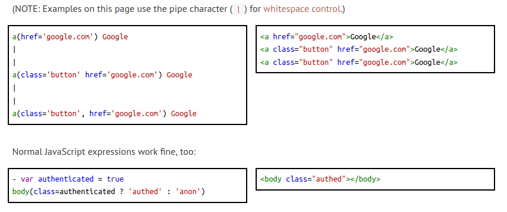
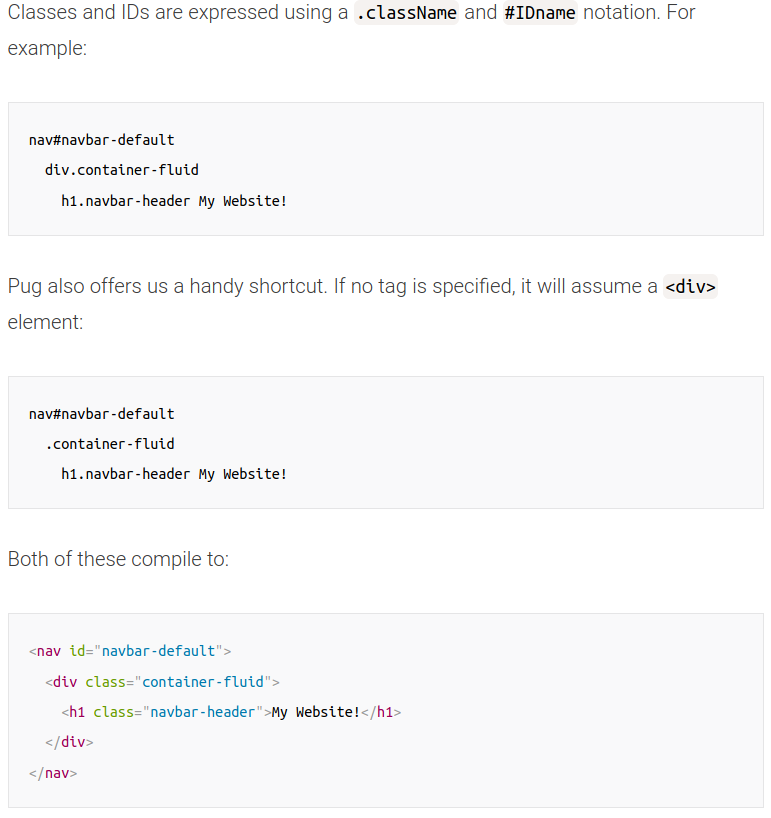
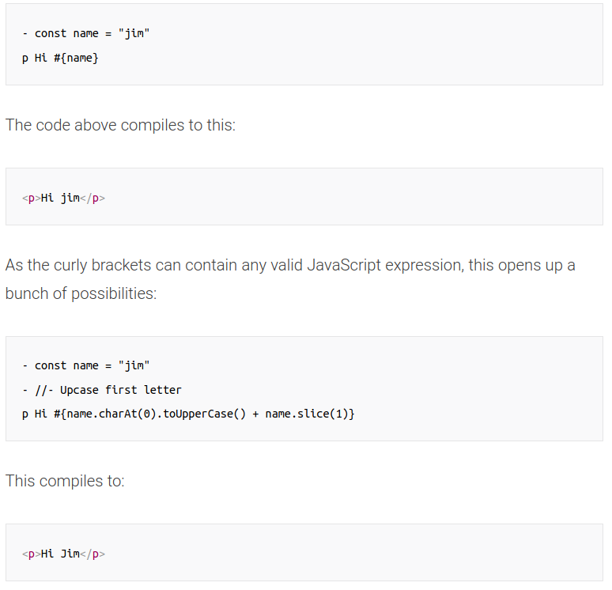

# Express Module

## Contents

- [Installation](#Installation)
- [How it works](#How-it-works)
- [Templating](#Templates)
- [Express-Generator](#Express-Generator)
- [Security](#Security)

## Installation

- `$npm install express`

### Basic Structure

```javascript
const var express = require('express') // Import class
var app = express() // Instantiate class as an object

app.route('/Node').get((req,res) => { // Arrow function
    res.send("Tutorial on Nodejs");
})
app.get('/',(req,res) => {
    res.send('Welcome to my tutorials page.');
})
```

## How it works

- Express.js *framework* makes it simple to create apps that handle multiple types of requests like the GET, PUT, and POST and DELETE. 

### Routing

- `app.METHOD(PATH, HANDLER)` where
  - app is an instance of `express`
  - METHOD is an HTTP request method in lowercase
  - PATH is a path on the server (route)
  - HANDLER is the function executed when the route is matched
- Same as Python Flask

```javascript
var express = require('express');
var app = express();
app.route('/Node').get(function(req,res)
{
    res.send("Tutorial on Node");
});
app.route('/Angular').get(function(req,res)
{
    res.send("Tutorial on Angular");
});
app.get('/',function(req,res){
    res.send('Welcome to my Tutorials');
}));
```

## Templates

- ~~$npm install jade~~ (depricated)
  - due to a trademark claim in 2015

### Pug

- `$npm install pug`

- [Pug Docs](https://pugjs.org/api/getting-started.html)

- A `*.pug` file must be compiled/processed into an `*.html` file via 

  - cli - `$npm i -g pug-cli` and `$pug -w . -o ./html -P`

  ```html
  // pug_file.pug ->
  doctype html
  html(lang='en')
   head
     title Hello, World!
   body
     h1 Hello, World!
     div.remark
       p Pug rocks!
  ```

  ```html
  <!DOCTYPE html>
  <html lang="en">
    <head>
      <title>Hello, World!</title>
    </head>
    <body>
      <h1>Hello, World!</h1>
      <div class="remark">
        <p>Pug rocks!!</p>
      </div>
    </body>
  </html>
  ```

  - in-file - `pug.[compile(), render()]`

- Basic file

  - ```html
    const pug = require('pug');
    
    // Compile template.pug, and render a set of data
    console.log(pug.renderFile('template.pug', {
      name: 'Timothy'
    }));
    // "<p>Timothy's Pug source code!</p>"
    ```

  - Then compile

### Attributes, href's, etc



[src](https://pugjs.org/language/attributes.html)

### Pug Classes, IDs, and Attributes



[src](https://www.sitepoint.com/a-beginners-guide-to-pug/#classesidsandattributes)

### Interpolation



[src](https://www.sitepoint.com/a-beginners-guide-to-pug/#interpolation)

## Express-Generator

### ToC for Express-Generator Section

- [Installation/Making](#Setup)
- [File Tree Explination](#File-Tree)
- [Static Serves](#Serving-Static-Files)
- [Routes](#Routes)

### Setup

1. `$ npx express-generator` OR to make with [pug (Templates)](../../expressNotes.md) default: `$ express --view=pug myapp`
2. change directory: `$ cd express_generator_app`
3. install dependencies: `$ npm install`
4. run the app: `$ DEBUG=express-generator-app:* npm start`

In the _package.json_ file there exists a line called start which will run `$node ./bin/www` for you.

[src](https://expressjs.com/en/starter/generator.html)

### File Tree

- `/public` - contains assets. These are static files the html references (images, javascript [ON THE WEBPAGE; not nodejs], css)
- `/routes` - site endpoints
- `/views` - representation of each individual html pages
- `/bin` - contains `www` executable
- `app.js` - entry point of whole app
- `/controllers` - how routes are organized

### Serving Static Files

- To serve static files such as images, CSS files, and JavaScript files, use the express.static built-in middleware function in Express.
- For example, use the following code to serve images, CSS files, and JavaScript files in a directory named public: `app.use(express.static('public'))`

### Routes

- How routes should be organized ([src](https://github.com/expressjs/express/blob/4.13.1/examples/route-separation/index.js#L32-L47)):

```javascript
// General

app.get('/', site.index);

// User

app.get('/users', user.list);
app.all('/user/:id/:op?', user.load);
app.get('/user/:id', user.view);
app.get('/user/:id/view', user.view);
app.get('/user/:id/edit', user.edit);
app.put('/user/:id/edit', user.update);

// Posts

app.get('/posts', post.list);
```

### Sources

- <https://expressjs.com/>
- <https://code.visualstudio.com/docs/nodejs/nodejs-tutorial>

## Security

- [Helmet](https://www.npmjs.com/package/helmet) - protects from *well-known* (xxs mainly) web vulnerabilities by adding headers [CSP, hsts, noCache, etc]
- Use cookies via `require('express-session')` and `require('cookie-session')`
- Ensure dependencies are secure with [Snyk](https://snyk.io/)
- To protect against CSRF, use [csurf](https://www.npmjs.com/package/csurf)
- Using strict/secure coding. Eg. 

> `app.set('views', path.join(__dirname, 'views'));` vs `app.set('views', (__dirname + '/views');`

## Sources

- <https://www.guru99.com/node-js-express.html>
- <https://www.sitepoint.com/a-beginners-guide-to-pug/>
- [security source](https://expressjs.com/en/advanced/best-practice-security.html)
