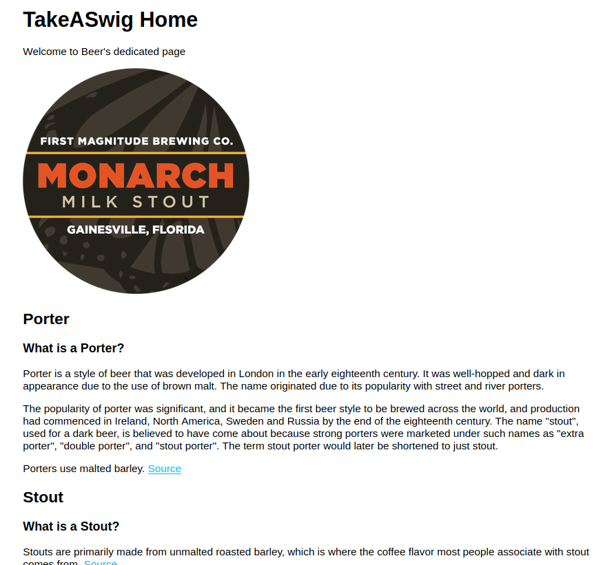

# Take A Swig

Fun web app I made to learn nodejs, express, pug, and created api routes (for bourbon only, sorta).

To easily set up Mongoose (MongoDB) backend: <https://scotch.io/tutorials/build-a-restful-api-using-node-and-express-4> and [here](https://www.robinwieruch.de/node-express-server-rest-api)

## Usage

- `$cd takeASwig`
- `$npm install`
- `$DEBUG=app.js:* npm start`

[Src](https://expressjs.com/en/starter/generator.html)

