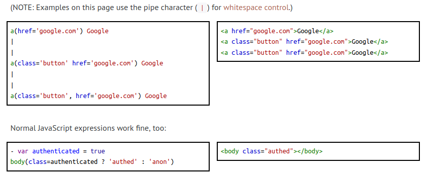
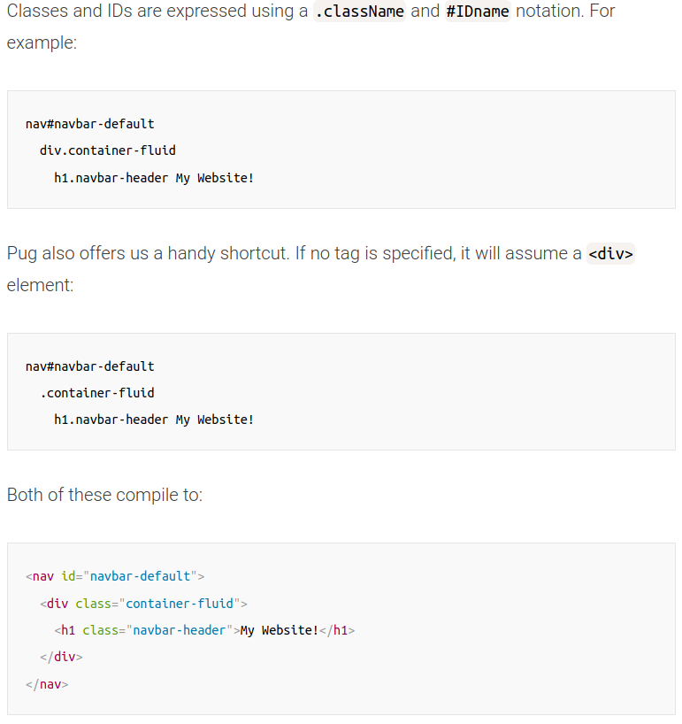
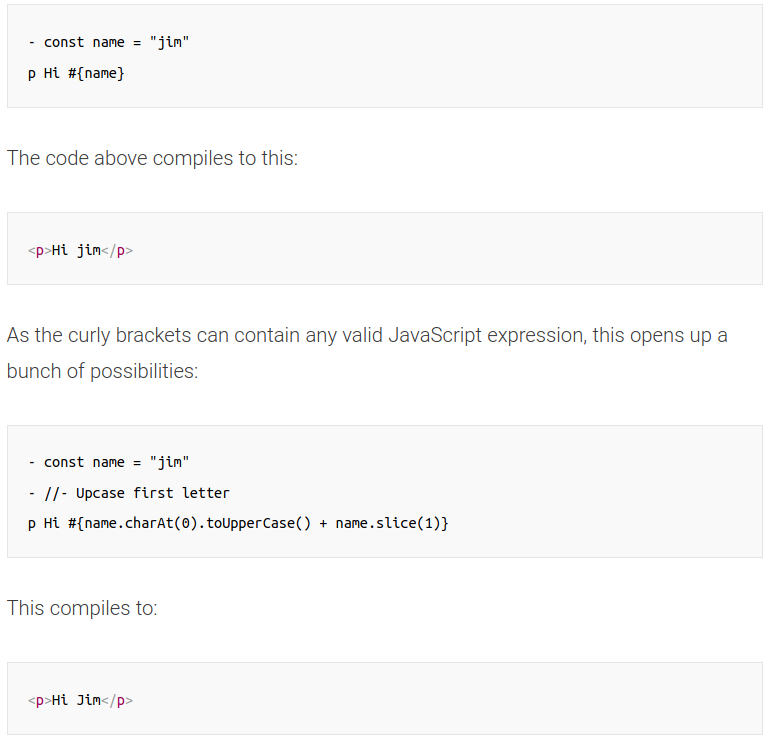

# Express Module

## Contents

- [Installation](#Installation)
- [How it works](#How-it-works)
- [Templating](#Templates)
- [Securit](#Security)
- [Full Example Code](#)

## Installation

- `$npm install express`

### Basic Structure

```javascript
const var Express = require('express') // Import class
var app = Express() // Instantiate class as an object

app.route('/Node').get((req,res) => { // Arrow function
    res.send("Tutorial on Nodejs");
})
app.get('/',(req,res) => {
    res.send('Welcome to my tutorials page.');
})
```


## How it works

- Express.js *framework* makes it simple to create apps that handle multiple types of requests like the GET,  PUT, and POST and DELETE. 

### Routing

- Same as Python Flask

```javascript
var express = require('express');
var app = express();
app.route('/Node').get(function(req,res)
{
    res.send("Tutorial on Node");
});
app.route('/Angular').get(function(req,res)
{
    res.send("Tutorial on Angular");
});
app.get('/',function(req,res){
    res.send('Welcome to Guru99 Tutorials');
}));
```


## Templates

- ~~$npm install jade~~ (depricated)
  - due to a trademark claim in 2015

### Pug

- `$npm install pug`

- [Pug Docs](https://pugjs.org/api/getting-started.html)

- A `*.pug` file must be compiled/processed into an `*.html` file via 

  - cli - `$npm i -g pug-cli` and `$pug -w . -o ./html -P`

  ```html
  // pug_file.pug ->
  doctype html
  html(lang='en')
   head
     title Hello, World!
   body
     h1 Hello, World!
     div.remark
       p Pug rocks!
  ```

  ```html
  <!DOCTYPE html>
  <html lang="en">
    <head>
      <title>Hello, World!</title>
    </head>
    <body>
      <h1>Hello, World!</h1>
      <div class="remark">
        <p>Pug rocks!!</p>
      </div>
    </body>
  </html>
  ```

  - in-file - `pug.[compile(), render()]`

- Basic file

  - ```html
    const pug = require('pug');
    
    // Compile template.pug, and render a set of data
    console.log(pug.renderFile('template.pug', {
      name: 'Timothy'
    }));
    // "<p>Timothy's Pug source code!</p>"
    ```

  - Then compile

  ### Attributes, href's, etc

  

  [src](https://pugjs.org/language/attributes.html)

  ### Pug Classes, IDs, and Attributes

  

  [src](https://www.sitepoint.com/a-beginners-guide-to-pug/#classesidsandattributes)

  ### Interpolation

  

  [src](https://www.sitepoint.com/a-beginners-guide-to-pug/#interpolation)

  

## Security

- [Helmet](https://www.npmjs.com/package/helmet) - protects from *well-known* (xxs mainly) web vulnerabilities by adding headers [CSP, hsts, noCache, etc]
- Use cookies via `require('express-session')` and `require('cookie-session')`
- Ensure dependencies are secure with [Snyk](https://snyk.io/)
- To protect against CSRF, use [csurf](https://www.npmjs.com/package/csurf)


## Sources

- <https://www.guru99.com/node-js-express.html>
- <https://www.sitepoint.com/a-beginners-guide-to-pug/>
- [security source](https://expressjs.com/en/advanced/best-practice-security.html)