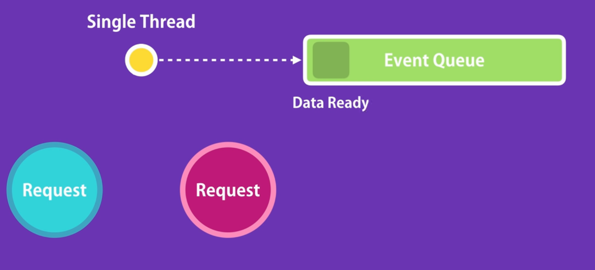

# Nodejs

## Contents

- [What/Why Node](#What-is/Why-node)
- [Basics](#Basic-Language-Notes)
- [Modules](#Modules)
- [Modules: http](#http)
- [Listener Example](#Full-Listener-Functionality)

### What is/Why node

- open source
- run JavaScript outside of browser
- can easily build api's

  - Browser engines are something to think about
    - Firefox :: SpiderMonkey, Edge :: Chakara, Chrome :: v8
- History: Ryan Dahl took Google's v8 and embed it in a C++ program.
- Node is a runtime environment to execute JavaScript code. It is not a programming language, nor is it a framework.
- Not for CPU intensive applications


### How Node Works

- Non-blocking Asynchronous
	- Not like synchronous languages like ASP or .Net 



## Basic Language Notes

There is no `window` object since nodejs doesn't just run of browsers anymore

**Scope**: A *Module* is every file in a node application. Every variable and function in a single module is private, unless explicitedly stated.

## Modules

### Creating a Module

To make a module public, we add to a module's exports.
> `module.exports.endPoint = url;` // Here endPoint is how another module may access the url variable/function

To then load the module, use `require('module')` syntax.

### Loading a Module

Best practice to use const on all requires.
> const logger = require('./logger');

```javascript
// logger.js

var url = 'https://jmussman.net'

function log(message) {
    // Send an HTTP request
    console.log(message);
}

module.exports.log = log;
```

If you do not want to export an object from a module and instead just a function - if your file is small/menial enough, we do this:

```javascript
// logger.js

var url = 'https://jmussman.net'

function log(message) {
    // Send an HTTP request
    console.log(message);
}

module.exports = log;
```

```javascript
// app.js

const log = require('./logger')

log('hello')
```

### Under the Hood - Scope

A module is run via an Immediately Invoked Function Expression ([IIFE](https://en.wikipedia.org/wiki/Immediately_invoked_function_expression)). Hence, nodejs doesn't actually run out code directly; instead it wraps it in this _iffy_ function.
> IIFE Function: `(function (exports, require, module, __filenam, __dirname){ //some code })`

### Useful Modules

- [Path Module](https://nodejs.org/api/path.html)
- [OS Module](https://nodejs.org/api/os.html)
    - Template string - ES6 || ES2015 : ECMAScript 6 - Defines what features are available in JavaScript
     - Use Template string to not have to concatenate; as seen below.

    ```javascript
    const os = require('os')
    var totalMem = os.totalmem()
    console.log(`Total Memory: ${totalMem}`)
    ```
- [File System Module](https://nodejs.org/api/fs.html)
    - When working with async functions, will always need a callback function; as seen below.
    - ```javascript
      const fs = require('fs')

      fs.readdir('./',function(err, files) {
        if (err) console.log('Error', err);
        else console.log('Result', files);
      })
      ```

        > returns `Result [ 'app.js`, 'logger.js' ]`
- [Events Module](https://nodejs.org/api/events.html)
    - A signal has happened in our app.
        - Ex: HTTP module listens to a new request (**Event**)
        - ```JavaScript
          const EventEmitter = require('events'); //Class is camel-case convention
          const emitter = new EventEmitter();

          emitter.on('messageLogged', function(){
          console.log('Listener called'); 
          }); // On aka addListerner

          // Listener, when an event is raised
          emitter.emit('messageLogged') // "Making a noise - signaling"
          ```

    - Now with EventArguments to pass data
        - ```javascript
          const EventEmitter = require('events'); //Class is camel-case convention
          const emitter = new EventEmitter();

          //Argument name doesnt matter but by convention `e` or `arg`
          emitter.on('messageLogged', function(e){
          console.log('Listener called', e); 
          }); // Also has addListerner

          // Listener, when an event is raised
          emitter.emit('messageLogged', {id: 1, url: 'http://'}); // "Making a noise - signaling"
            ```
    - Arrow-Function allows:
        - ```javascript
          emitter.on('logging', (e) => {
            console.log('You got me!', e);
          });
          ```
    - Actually, you will rarely interact with EventEmitter module. More than likely it will be wrapped.

#### HTTP
- [HTTP Module](https://nodejs.org/api/http.html)
    - ```javascript
        // http_app.js

        const http = require('http');

        const server = http.createServer((req, res) => {
        //These routes look very familiar to Flask!
            if (req.url === '/') {
                res.write('Hello world');
                res.end();
            }

            if (req.url === '/courses'){
                res.write(JSON.stringify([1,2,3,4,5]));
                res.end();
            }
        });

        server.listen(3000);

        console.log('Listening on port 3000...'); 
        
        // GoTo localhost:3000 && localhost:3000/courses
      ```
---

## Full Listener Functionality

```javascript
// app.js

const Logger = require('./logger');
const logger = new Logger();

logger.on('messageLogged', (e) => {
    console.log('Listener called', e); 
 });
 
 logger.log('message');
```

```javascript
// logger.js

const EventEmitter = require('events'); //Class is camel-case convention

var url = 'https://jmussman.net'

class Logger extends EventEmitter {
    // Don't need function keyword 
    // in class because its now considered a method.
    log(message) { 
        // Send an HTTP request
        console.log(message);
    
        // Raise an event
        // Note 'this' keyword
        this.emit('messageLogged', {id: 1, url: 'http://'});
    }
}

module.exports = Logger;
```